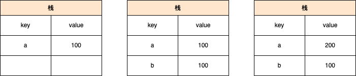
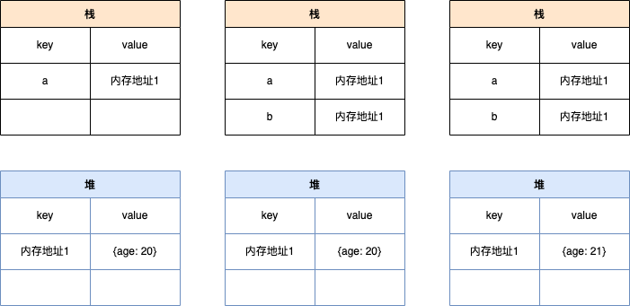

# 变量类型

1. 值类型 vs 引用类型

```js
// 值类型
let a = 100;
let b = a;
a = 200;
console.log(b); // 100
```



```js
// 引用类型
let a = { age: 20 };
let b = a;
b.age = 21;
console.log(a.age); // 21
```



常见的值类型：

```js
let a; // undefined
const s = "abc"; // string
const n = 100; // number
const b = true; // boolean
const s = Symbol("s"); // Symbol
```

常见的引用类型：

```js
const obj = { x: 100 }; // Object
const arr = ["a", "b", "c"]; // Array
const n = null; // 特殊类型的引用，指针指向空地址

// 特殊引用类型，单不用于存储数据，所以没有“拷贝、复制函数”这一说
function fn() {}
```

2. typeof 运算符

作用：

- 识别所有值类型
- 识别函数
- 判断是否是引用类型（不可再细分）

```js
// 判断所有的值类型
let a;
typeof a; // 'undefined'

const str = "abc";
typeof str; // 'string'

const n = 100;
typeof n; // 'number'

const b = true;
typeof b; // 'boolean'

const s = Symbol("s");
typeof s; // 'symbol'
```

```js
// 能判断函数
typeof console.log; // 'function'
typeof function () {}; // 'function'

// 能识别引用类型
typeof null; // 'object'
typeof ["a", "b", "c"]; // 'object'
typeof { x: 100 }; // 'object'
```

3. 深拷贝

```js
console.log("deepClone");

const obj1 = {
  age: 20,
  name: "XXX",
  address: {
    city: "北京",
  },
  arr: ["a", "b", "c"],
};

/**
 * 深拷贝
 * @param {Object} obj 要拷贝的对象
 */
function deepClone(obj = {}) {
  if (typeof obj !== "object" || obj == null) {
    // 不是对象或数组或者是null，直接返回
    return obj;
  }

  // 初始化返回结果
  let result;
  if (obj instanceof Array) {
    result = [];
  } else {
    result = {};
  }

  for (let key in obj) {
    //   保证key不是原型的属性
    if (obj.hasOwnProperty(key)) {
      // 递归调用
      result[key] = deepClone(obj[key]);
    }
  }
  // 返回结果
  return result;
}

const res = deepClone(obj1);
res.address.city = "大三大四";
console.log(res.address.city); // 大三大四
console.log(obj1.address.city); // 北京
```

# 变量计算-类型转换

1. 字符串拼接

```js
const a = 100 + 10; // 110
const b = 100 + "10"; // '10010'
const c = true + "10"; // 'true10'
```

2. ==

```js
100 == '100' // true
0 == '' // true
0 == false // true
false == '' true
null == undefined // true
```

```js
// 除了==null之外，其他一律用===，例如：
const obj = { x: 100 };
if (obj.a == null) {
}

// 相当于
// if(obj.a===null || obj.a===undefined){}
```

3. if 语句和逻辑运算

truly 变量：!!a === true 的变量

falsely：!!a === false 的变量
