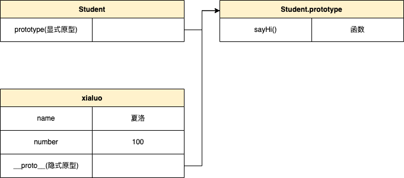
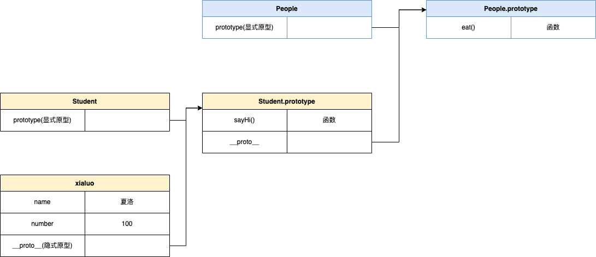

# class 和继承

1. class

class 类似一个模版，可以通过这个模版去构建一些东西

其中包含：

- constructor
- 属性
- 方法

2. 继承

可以将公共的属性抽离出来，然后通过继承来获取这些属性。

- extends
- super
- 扩展和重写一些方法

# 类型判断 instanceof

```js
xialuo instanceof Student // true
xialuo instanceof People // true
xialuo instanceof Object // true

[] instanceof Array // true
[] instanceof Object // true

{} instanceof Object // true
```

# 原型和原型链

1. 原型

```js
// class实际上是函数，可见是语法糖
typeof People; // 'function'
typeof Student; // 'function'

// 隐式原型和显式原型
console.log(xialuo.__proto__);
console.log(xialuo.prototype);
console.log(xialuo.__proto__ === Student.prototype);
```

原型关系：

- 每个`class`都有显式原型`prototype`
- 每个实例都有隐式原型`__proto__`
- 实例的`__proto__`指向对应`class`的`prototype`

基于原型的执行规则：

- 获取属性 xialuo.name 或执行方法 xialuo.sayHi()时
- 先在自身属性和方法寻找
- 如果找不到则自动去`__proto__`中去找



2. 原型链

```js
console.log(Student.prototype.__proto__);
console.log(People.prototype);
console.log(People.prototype === Student.prototype.__proto__);
```



instanceof 会顺着`__proto__`一直往上找，能不能找到某个类型的显式原型，如果能找到，就返回 true，找不到返回 false

3. 重要提示

class 是 ES6 语法规范，由 ECMA 委员会发布

ECMA 只规定语法规则，即我们代码的书写规范，不规定如何实现

以上实现方式都是 V8 引擎的实现方式，也是主流的

# 题目解析

1. 如何判断一个变量是不是数组？

使用 instanceof 去判断

```js
a instanceof Array;
```

2. 手写一个简易的 jQuery，考虑插件和扩展性

```js
class jQuery {
  constructor(selector) {
    const result = document.querySelectorAll(selector);
    const length = result.length;
    for (let i = 0; i < length; i++) {
      this[i] = result[i];
    }

    this.length = length;
    this.selector = selector;
  }

  get(index) {
    return this[index];
  }

  each(fn) {
    for (let i = 0; i < this.length; i++) {
      const elem = this[i];
      fn(elem);
    }
  }

  on(type, fn) {
    return this.each((elem) => {
      elem.addEventListener(type, fn, false);
    });
  }
}

// 插件形式
jQuery.prototype.dialog = function (info) {
  console.log(info);
};

// “造轮子”
class myJQuery extends jQuery {
  constructor(selector) {
    super(selector);
  }
  // 扩展自己的方法
  addClass(className) {}
  style(data) {}
}
```

3. class 的原型本质，怎么理解？

原型和原型链的图示

属性和方法的执行规则
